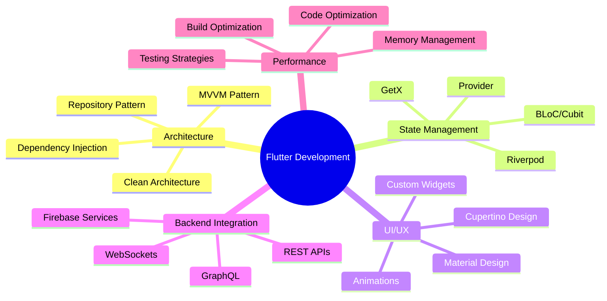

<div align="center">

# 🚀 Ajit Singh Rathore
### 📱 Senior Flutter Developer | Cross-Platform Mobile App Specialist


[](https://your-portfolio.com)
[](https://www.linkedin.com/in/your-linkedin/)
[](mailto:your-email@example.com)
[](https://twitter.com/your-handle)


</div>

---

## 🎯 About Me

```dart
class FlutterDeveloper {
  final String name = "Ajit Singh Rathore";
  final String role = "Senior Flutter Developer";
  final List<String> specializations = [
    "Cross-Platform Mobile Development",
    "Clean Architecture Implementation", 
    "Custom UI/UX Design",
    "Performance Optimization",
    "State Management Solutions"
  ];
  
  final Map<String, int> experience = {
    "Flutter Development": 4,
    "Mobile App Architecture": 3,
    "Firebase Integration": 3,
    "API Integration": 4
  };
  
  void buildAwesomeApps() {
    print("Crafting pixel-perfect, high-performance mobile experiences! 🚀");
  }
}
```

<div align="center">

## 🛠️ Technology Arsenal

</div>

### 📱 Mobile Development
<p align="center">
  
</p>

<div align="center">


</div>

### 🎨 UI/UX & Design
<p align="center">
  
</p>

<div align="center">


</div>

### ⚡ State Management & Architecture
<div align="center">


</div>

### 🔧 Development Tools & Services
<p align="center">
  
</p>

<div align="center">


</div>

---

<div align="center">

## 📊 GitHub Analytics


</div>

---

<div align="center">

## 🏆 Featured Projects

<table>
<tr>
<td width="50%">

### 🎯 Project Showcase 1
[](https://github.com/rathoreAjitSingh-1887/flutter-project-1)

**Tech Stack:** Flutter • Firebase • Provider
- 🚀 High-performance mobile app
- 🎨 Custom UI/UX implementation
- 📱 Cross-platform compatibility

</td>
<td width="50%">

### 🎯 Project Showcase 2
[](https://github.com/rathoreAjitSingh-1887/flutter-project-2)

**Tech Stack:** Flutter • BLoC • REST APIs
- ⚡ State-of-the-art architecture
- 🔄 Real-time data synchronization
- 🛡️ Secure authentication system

</td>
</tr>
</table>

</div>

---

## 📱 Mobile App Portfolio

<div align="center">

### 🎯 Published Applications

[](https://apps.apple.com/developer/your-id)
[](https://play.google.com/store/apps/developer?id=your-id)
[](https://your-web-app.com)

<table>
<tr>
<th>App Name</th>
<th>Category</th>
<th>Downloads</th>
<th>Rating</th>
<th>Platform</th>
</tr>
<tr>
<td>🎯 App One</td>
<td>Productivity</td>
<td>10K+</td>
<td>⭐ 4.8</td>
<td>iOS & Android</td>
</tr>
<tr>
<td>🚀 App Two</td>
<td>E-commerce</td>
<td>25K+</td>
<td>⭐ 4.6</td>
<td>Cross-Platform</td>
</tr>
<tr>
<td>💡 App Three</td>
<td>Educational</td>
<td>15K+</td>
<td>⭐ 4.9</td>
<td>iOS & Android</td>
</tr>
</table>

</div>

---

## 📈 Development Activity

<div align="center">


</div>

---

## 🎯 Core Competencies

<div align="center">



</div>

---

## 🌱 Currently Exploring

<div align="center">

| Technology | Progress | Focus Area |
|------------|----------|------------|
| **Flutter Web** | 🟦🟦🟦🟦🟦🟦🟦⬜⬜⬜ 70% | Progressive Web Apps |
| **Flutter Desktop** | 🟦🟦🟦🟦🟦🟦⬜⬜⬜⬜ 60% | Cross-platform Desktop |
| **WebRTC** | 🟦🟦🟦🟦🟦🟦🟦🟦⬜⬜ 80% | Real-time Communication |
| **AI/ML Integration** | 🟦🟦🟦🟦🟦⬜⬜⬜⬜⬜ 50% | Smart Features |
| **Flutter 3.x** | 🟦🟦🟦🟦🟦🟦🟦🟦🟦⬜ 90% | Latest Features |

</div>

---

## 💼 Professional Services

<div align="center">

### 🎯 What I Offer

<table>
<tr>
<td align="center" width="33%">

### 📱 Mobile App Development
- Cross-platform Flutter apps
- Native iOS & Android feel
- Custom UI/UX implementation
- Performance optimization

</td>
<td align="center" width="33%">

### 🔧 Architecture & Consulting
- Clean architecture setup
- Code review & optimization
- State management solutions
- Best practices implementation

</td>
<td align="center" width="33%">

### 🚀 MVP & Prototyping
- Rapid prototyping
- MVP development
- Technical feasibility analysis
- Technology stack consultation

</td>
</tr>
</table>

</div>

---

## 📚 Knowledge Sharing

<div align="center">

### 📝 Latest Articles & Tutorials

<!-- BLOG-POST-LIST:START -->
- 🔥 [Advanced Flutter Animations: Creating Smooth Transitions](https://your-blog.com/flutter-animations)
- ⚡ [State Management in Flutter: A Complete Comparison](https://your-blog.com/state-management)
- 🎨 [Building Responsive UIs: Flutter Best Practices](https://your-blog.com/responsive-ui)
- 🚀 [Flutter Performance Optimization: Tips & Tricks](https://your-blog.com/performance-tips)
- 🔐 [Implementing Secure Authentication in Flutter](https://your-blog.com/authentication)
<!-- BLOG-POST-LIST:END -->

[](https://medium.com/@your-handle)
[](https://dev.to/your-handle)
[](https://your-handle.hashnode.dev)

</div>

---

## 🤝 Let's Connect & Collaborate

<div align="center">

### 💬 Open for Opportunities


[](mailto:your-email@example.com)
[](https://calendly.com/your-handle)
[](https://calendly.com/your-handle)

### ☕ Support My Work

[](https://www.buymeacoffee.com/your-handle)
[](https://ko-fi.com/your-handle)
[](https://github.com/sponsors/rathoreAjitSingh-1887)

</div>

---

<div align="center">

## 🎯 Profile Statistics


**⭐️ From [rathoreAjitSingh-1887](https://github.com/rathoreAjitSingh-1887) with ❤️**

</div>

<!-- Easter Egg: You found it! 🎉 --> 
